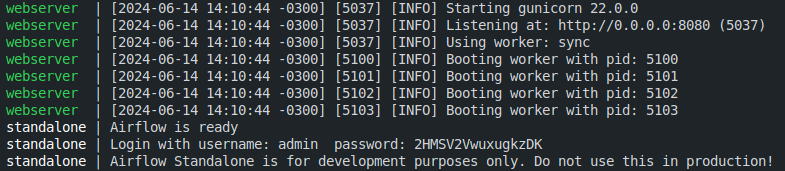
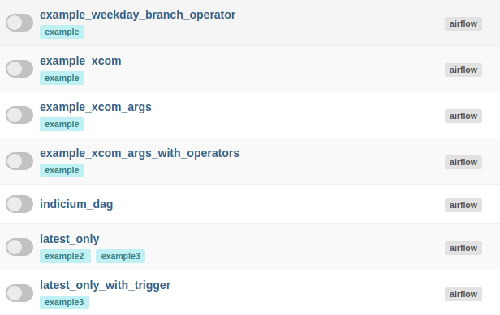
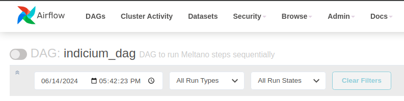

## Sequência de desenvolvimento

1. Criação de extratores (tap-postgres e tap-csv) e carregadores (target-jsonl) para a primeira etapa usando o Meltano.
2. Configuração dos mesmos, transferindo dados entre si manualmente.
3. Automação no processo de transferência de dados entre extratores e carregadores na primeira etapa, usando um script escrito em Python.
4. Transformação dos arquivos JSONL gerados na extração para CSV usando Pandas.
5. Criação de extratores (tap-csv) e carregadores (target-postgres) para a segunda etapa usando o Meltano.
6. Criação de um banco de dados PostgreSQL vazio na porta 5433 no Docker para o carregamento de dados.
7. Configuração dos mesmos, transferindo dados entre si manualmente.
8. Automação no processo de transferência de dados entre extratores e carregadores na segunda etapa, usando um script escrito em Python.
9. Separando ambientes de desenvolvimento para o Meltano e para o Apache Airflow, pois o Meltano necessita do SQLAlchemy de versões entre 2.0.30 e 3.0.0, e o Apache Airflow necessita do SQLAlchemy de versões 1.4.52 ou inferior, e assim evitando conflitos.
10. Criando Bash Scripts para execução dos scripts Python do Meltano, que está em ambiente de desenvolvimento diferente.
11. Criação da DAG separada em duas partes.
12. Execução da DAG.

## Como executar em distribuições Linux baseadas em Ubuntu

1. Clone o repositório no diretório ```Home```, utilizando o comando: ```git clone https://github.com/fco3lho/indicium-test.git```.

2. Entre no diretório do projeto, utilizando o comando: ```cd indicium-test```. Certifique-se que o diretório do projeto seja: ```~/indicium-test```.

3. Possuindo Docker e Docker Compose instalado em sua máquina, execute o comando ```docker compose up -d``` para iniciar os bancos de dados PostgreSQL para extração e carregamento de dados.

4. Entre no diretório da primeira etapa do projeto utilizando o comando ```cd ~/indicium-test/first_step``` e crie o ambiente virtual da primeira etapa executando o comando ```python3 -m venv venv```.

5. Após criar o ambiente virtual da primeira etapa, 
    1. Ative o ambiente virtual executando o comando ```source venv/bin/activate```, 
    2. Instale as bibliotecas utilizadas executando o comando ```pip install -r requirements.txt```, 
    3. Instale os plugins Meltano com o comando ```meltano install```, 
    4. Desative o ambiente virtual da primeira etapa executando o comando ```deactivate```.

6. Entre no diretório da segunda etapa do projeto utilizando o comando ```cd ~/indicium-test/second_step``` e crie o ambiente virtual da segunda etapa executando o comando ```python3 -m venv venv```.

7. Após criar o ambiente virtual da segunda etapa, 
    1. Ative o ambiente virtual executando o comando ```source venv/bin/activate```, 
    2. Instale as bibliotecas utilizadas executando o comando ```pip install -r requirements.txt```, 
    3. Instale os plugins Meltano com o comando ```meltano install```, 
    4. Desative o ambiente virtual da segunda etapa executando o comando ```deactivate```.


8. Voltando ao diretório ```~/indicium-test```, 
    1. Execute o comando ```python3 -m venv venv``` para criar o ambiente virtual destinado ao Apache Airflow, 
    2. Ative o ambiente virtual executando o comando ```source venv/bin/activate```, 
    3. Instale as bibliotecas necessárias executando o comando ```pip install -r requirements.txt```.
    4. Dê permissão de execução para o script Bash da primeira etapa executando o comando: ```chmod +x run_first_step.sh```.
    5. Dê permissão de execução para o script Bash da segunda etapa executando o comando: ```chmod +x run_second_step.sh```.

9. Com o Apache Airflow instalado e com o ambiente de desenvolvimento ativado, execute o comando ```airflow standalone```. No final da execução deste comando, será fornecido ao usuário as credenciais de login para acessar o Airflow na porta 8080, como no exemplo abaixo, que o username é <strong>admin</strong> e a senha é <strong>2HMSV2VwuxugkzDK</strong>.



10. Com o servidor do Apache Airflow em funcionamento, abra outro terminal e crie a pasta de DAGs no diretório do Airflow executando o comando ```mkdir ~/airflow/dags```. (Fora do ambiente de desenvolvimento)

11. Com a pasta de DAGs criada, copie a DAG do projeto para a pasta de DAGs do Airflow com o comando ```cp ~/indicium-test/indicium_dag.py ~/airflow/dags/```

12. Agora, vá até o navegador e digite a URL ```http://localhost:8080/```. A página de login do Apache Airflow será mostrada e é possível conectar usando as credenciais recebidas no passo 9.

13. Uma lista de DAGs será mostrada, procure a DAG com nome <strong>indicium_dag</strong> e clique nela. (Pode demorar um pouco até que o servidor atualize e a DAG seja mostrada na lista).



14. Para executar a DAG, clique no  botão ao lado do título com nome da DAG.



15. Após isso, você poderá ver sua DAG sendo executada passo por passo na aba de <strong>graph</strong>.


16. Quando a DAG for totalmente executada com êxito, será possível ver um arquivo JSON na pasta ```~/indicium-test/messages/``` contendo a mensagem de sucesso na execução, juntamente com a data e a hora do término da execução.

### Quando finalizado, será possível consultar o banco de dados e ver que todas as tabelas foram carregadas. Para isso, siga o passos abaixo:

1. Com os containers dos bancos de dados funcionando, digite o seguinte comando no terminal: ```docker exec -it indicium-test-db_loader-1 psql -U user -d db_loader```. Este comando lhe conectará ao banco de dados para fazer consultas.

2. Faça consultas no banco de dados no seguinte formato: <strong>SELECT * FROM tap_csv.(Nome da tabela);</strong>. Exemplo: ```SELECT * FROM tap_csv.suppliers;```